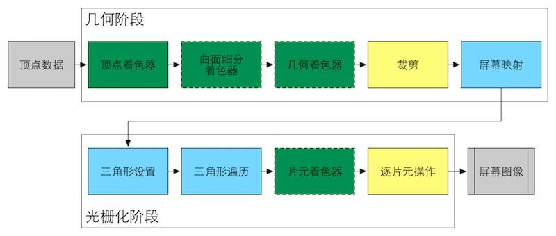
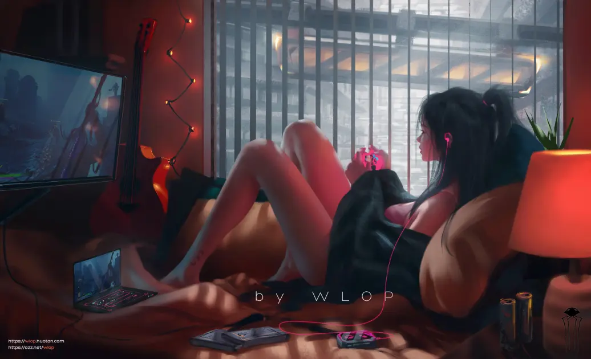

# 【Catlike Coding Custom SRP学习之旅】Custom Render Pipeline
#### 写在前面
我是一个计算机图形学领域的新手，虽然在游戏公司实习了有一段时间，但我对图形学的认知仍然十分肤浅，我目前看过Games 101，最近也把冯乐乐的《Shader入门精要》看完了，因此我的图形学知识只会小于等于这两者（忘了好多55），接下来我打算学习下SRP，参考其他大佬们的文章，并记录下自己的笔记，也算是给自己挖个坑吧（之前其实自己跟着Catlike做过前几章，但后来半途而废了），希望自己能填完这个坑。因为我的知识有限同时又喜欢无知地乱写，如果笔记中有错误，欢迎批评指正。


以下是原教程链接与我的Github工程：
[CatlikeCoding-SRP-Tutorial](https://catlikecoding.com/unity/tutorials/custom-srp/)
[我的Github工程](https://github.com/recaeee/CatlikeCoding-Custom-RP)

我使用的Unity版本为2021.3.11f1c2(教程中使用的为2019.2.6f1，希望之后不会给自己挖坑)，初始项目为Built-in的模板工程。废话了这么多，进入正题吧。


---

#### 自定义渲染管线 Custom Render Pipeline
在谈自定义渲染管线前，先唠唠**渲染管线**吧。

其实到现在为止，我仍然对渲染管线的概念模糊不清，在我的理解里，渲染管线是一个将一个数字几何世界呈现到屏幕上的抽象流程。而其对应的具体流程就是冯乐乐书中最开头讲的渲染流水线,即“计算机需要从一系列的顶点数据、纹理等信息出发，把这些信息最终转换成一张人眼可以看到的图像”。

而从接触图形学开始，我就对渲染管线的具体流程的理解十分粗暴，顶点数据首先进入顶点着色器进行MVP变换转换到摄像机空间，然后光栅化，每个片段进入片段着色器，设置每个片段的颜色，最后把像素呈现到屏幕上。（总感觉少了些很多东西呢）



在我的理解里，整个渲染的流程就如上图所示，通过openGL简单编写上述流程，最后我们很容易就能获得一幅无趣的图像。但在游戏中，我们需要实现光照、阴影等效果，而阴影贴图的渲染并不在上述这些阶段中（虽然说其实阴影贴图的渲染走的也是上面这一套流程，只是不是输出到屏幕图像上），那我们怎么样把阴影的实现加进去呢？而同时基于各种需求又会有前向渲染和延迟渲染，我们在哪一步生成阴影贴图，怎么样把各种效果，比如UI、透明物体叠加在原本无趣的图像上，渲染管线似乎就无法简单地像上述图片上所描述的那样了。

上述只是我对渲染管线的一定理解吧，其实参考[这个知乎问题的回答](https://www.zhihu.com/question/379346645/answer/1079363174)，可能会理解得更透彻一些，总结来说，上图中的”渲染管线”是指**GPU硬件层面的渲染管线**，而“自定义渲染管线”中的“渲染管线”是**应用层面的高级渲染管线，是需要通过api调用来搭建的管线**。

参考[丛越大佬对渲染管线的描述](https://zhuanlan.zhihu.com/p/70668533)，**渲染管线是游戏引擎完成一帧画面的高层渲染逻辑和流程**，而一些引擎中传统的前向和延迟渲染管线往往只开放了管线中一些顶点着色器、片元着色器的可编辑性，而这些局限的编辑肯定无法满足如今游戏开发者们对画面、性能的追求，比如NPR等风格化渲染，用那一套传统的管线去实现那些与众不同的效果就好比想尽办法拿两辆自行车拼一起组装成跑车，吃力也不一定能达到效果。换句话说，都什么年代了，都还在用传统管线。

我在网上也找到了一些对于为什么要选择使用自定义渲染管线而不是传统渲染管线的[讨论](https://www.zhihu.com/question/379857981)，总而言之，学习自定义渲染管线不仅能让自己更自由地去做开发，同时也能让自己对渲染管线的认识更进一步。

从Unity 2018开始，Unity就引入了自定义渲染管线，它实现了让我们在渲染流程中做任何事情，并且提供给了我们传统渲染管线中的那些工具，比如裁剪。这也就意味着像裁剪、设置相机属性、支持光源等传统渲染管线中必不可少的一些工作不需要我们自己编写，直接调用Unity封装好的函数就行了。这想想都让人兴奋吧，就好比我想自己创作一幅画，但基本所有我要用的画笔、工具、颜料都有人帮我准备好了，我只要管往画布上乱涂乱画就行了。在我的理解中，自定义渲染管线就是这样的一个东西：**我可以自定义渲染管线中的任何流程，并且已经给我准备好了基础的工具，不需要像编写OpenGL一样自己编写所有的操作**。

好了好了，你已经大致了解什么是渲染管线了，接下来就由你自己编写一套高质量渲染管线吧！:)（开始变成无情的翻译机器人）

（我只会对其中重要的部分进行翻译和解释，其他则会简单带过，否则量太多了）

---
#### 1.1 新建工程 Project Setup



进入项目第一步，进入PackageManager把除了*Unity UI*之外的Package全删了（保持项目中不存在没用到的Package和代码块是良好的习惯，当然我还保留了IDE的Package），然后把颜色空间从Gamma空间设置成线性空间（不要问我怎么设置，看原教程吧~）。

下一步，在场景中摆一些standard、unlit和transparent材质的物体。


#### 1.2 管线资源 Pipeline Asset

此时，Unity使用的Render Pipeline是默认的也就是Builtin的内置渲染管线，从Project Setting窗口中也可以看出。


因此，为了使用自定义渲染管线，我们要做的第一件是创建一个**自定义**的Render Pipeline Asset，*Render Pipeline Asset*是Unity已经定义好的一种Asset类型，既然要使用自定义的Asset，所以我们需要自己定义一个Asset类，让它继承自*RenderPipelineAsset*，这个自定义的类我们就叫它**CustomRenderPipelineAsset**，这里首先要明确的一点是，它是一个类型，我们要通过这个类型创建它的Asset实例来当作我们的Render Pipeline Asset。

现在一定会有人好奇这个Render Pipeline Asset是用来干啥的吧，其实Render Pipeline Asset的作用就是**定义**（注意，不是确定实际数值）了一些实际渲染时的参数，比如阴影质量、光照质量等。

那实际**确定**这些数值是多少的是谁呢？是**RenderPipeline**（这也就是为什么RenderPipelineAsset里会有一个函数叫CreatePipeline，同时这就意味着RenderPipeline的创建是基于RenderPipelineAsset的），RenderPipeline确定了实际游戏运行时我们的阴影质量是高是低这些。那为什么Unity要搞得这么复杂呢，我定义了一个Asset，结果这个Asset还只是定义了一些定义，然后最后应用的实例是RenderPipeline，哇这也太麻烦了。Unity这样做是有它的道理的，因为在实际游戏中，我们不可能只使用一套实际的参数，那就涉及到了我们会创建多个实际的RenderPipeline应用于不同质量的渲染上，其实很好理解吧，不同性能的设备上用的RenderPipeline肯定不同，不可能在一台低端机上跑很高质量的渲染，同时一台设备上，我可能也需要实时去切换渲染的质量。

写好RenderPipelineAsset的定义，CreatePipeline返回null之后，创建一个CustomRenderPipelineAsset,然后使用它，好，画面变黑啦~

```using UnityEngine;
using UnityEngine.Rendering;

[CreateAssetMenu(menuName = "Rendering/Custom Render Pipeline")]
public class CustomRenderPipelineAsset : RenderPipelineAsset
{
    //重写创建实际RenderPipeline的函数
    protected override RenderPipeline CreatePipeline()
    {
        //暂时返回null
        return null;
    }
}
```

#### 1.3 渲染管线实例 Render Pipeline Instance


## 参考
1. https://catlikecoding.com/unity/tutorials/custom-srp/custom-render-pipeline/
2. 冯乐乐《Shader入门精要》
3. https://zhuanlan.zhihu.com/p/366139386
4. https://zhuanlan.zhihu.com/p/70668533
5. https://www.zhihu.com/question/379857981
6. https://www.zhihu.com/question/379346645/answer/1079363174